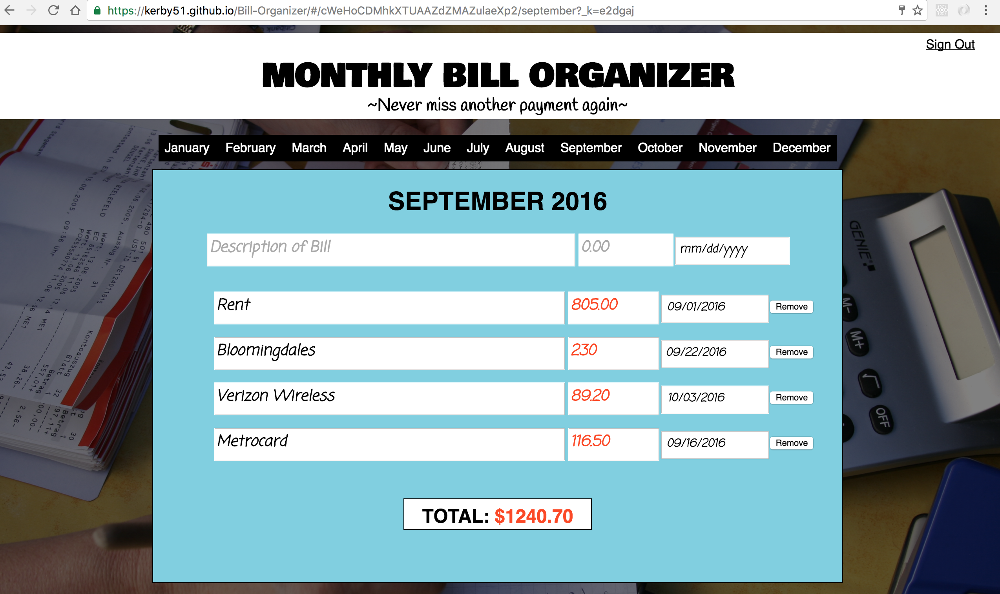

# MONTHLY-BILL-ORGANIZER

### A tool where a user can sign-in/register to manually enter and organize their finances each month

User has the ability to register/sign-up for an account with email and password authentication. If they already have an account, then simply sign-in to view their information.  Once logged in, the user will be presented with a link to each month of the year (in this case, it is just the 2016 calendar year) where they can click on a month and then manually enter their financial expenses, including a description, an amount, and due date.  The total will automatically update with each bill entry.

Still working on:  cross browser compatibility, a trend bar graph in the user's dashboard, some additional styling.

Tech used:
* HTML5
* CSS
* Javascript 
* ReactJS
* Firebase

 
